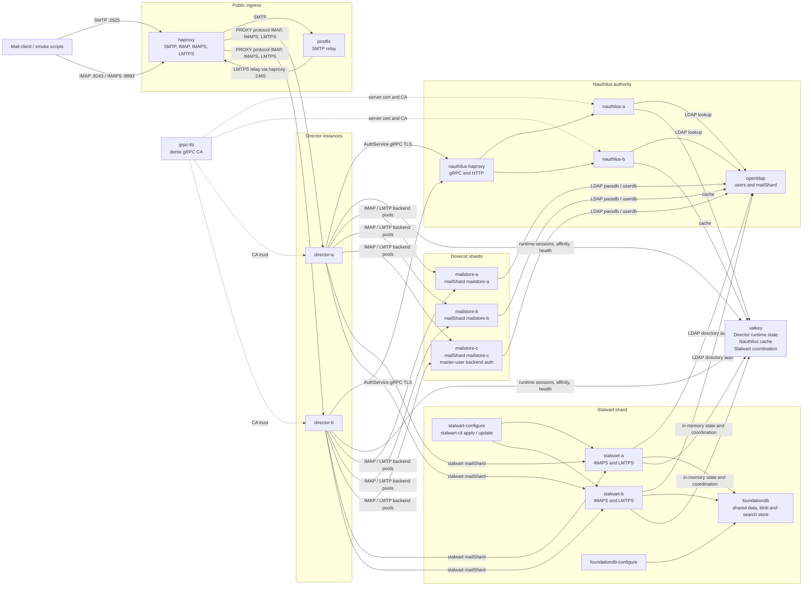

# Nauthilus Director Demo Stack

This stack is a runnable integration playground for the production Director path. The Director image is built from this repository; every other image is pinned through `.env.example`.

## Topology

- HAProxy publishes SMTP, IMAP, IMAPS and LMTPS on host ports.
- SMTP is handled by HAProxy and Postfix. Postfix relays accepted mail back through HAProxy over LMTPS to the two Director instances.
- IMAP, IMAPS and LMTPS traffic from HAProxy to the Directors uses the PROXY protocol.
- The Directors own backend selection, health handling, affinity and metrics.
- Nauthilus is intentionally lean in this stack: LDAP/cache identity, OpenLDAP-released `mailShard` routing facts and a small Lua environment hook only.
- An internal HAProxy balances Director authority traffic across two Nauthilus instances.
- The Directors authenticate through that internal HAProxy to the TLS-protected Nauthilus gRPC AuthService.
- Three Dovecot 2.4 containers provide IMAPS and LMTPS backend shards. All three use OpenLDAP for passdb/userdb lookups.
- `mailstore-c-imap` is intentionally wired with Director `master_user` backend auth; the other Dovecot IMAP shards use credential replay.
- A FoundationDB-backed Stalwart pair provides an additional `stalwart` backend shard through demo IMAPS and LMTPS listeners.
- The Stalwart instances share FoundationDB for data, blobs and search, and use the demo Valkey service for short-lived in-memory state and cluster coordination.
- Stalwart is configured from the command line: `stalwart-configure` waits for both instances, applies `stalwart/bootstrap.ndjson` through `stalwart-cli`, and then enables the built-in user role for LDAP-backed accounts. No GUI is required or exposed on the host.
- OpenLDAP contains six demo users plus an internal health-check account. Nauthilus, Dovecot and Stalwart all use it as their identity source.



## Demo Users

All users use the password `demo-secret`.

| User | Shard |
| --- | --- |
| `alice@example.test` | `mailstore-a` |
| `bob@example.test` | `mailstore-b` |
| `carol@example.test` | `mailstore-c` |
| `dave@example.test` | `mailstore-a` |
| `erin@example.test` | `stalwart` |
| `frank@example.test` | `stalwart` |

`healthcheck@example.test` is an internal backend health-check identity and is not meant for client smoke tests.

## Run

```bash
cd contrib/demo-stack
cp .env.example .env
docker compose up --build -d
```

The default Stalwart Docker image does not include FoundationDB support. The
demo therefore builds the Stalwart containers from the upstream
`Dockerfile.fdb` build context named by `STALWART_FDB_BUILD_CONTEXT` in `.env`.
The first `docker compose up --build -d` can take a long time, especially on
older machines, because this compiles the FoundationDB-enabled Stalwart image.
That first build can look quiet for several minutes. Later starts reuse the
Docker build cache unless the Stalwart build context or Dockerfile changes.

The official Dovecot image ships with a static test passdb. This demo replaces
that with `dovecot/auth.conf`, which binds Dovecot to OpenLDAP for user
authentication and LMTP recipient lookup. `mailstore-c-imap` uses the Director
master user `nauthilus-director` with `DOVECOT_MASTER_PASSWORD`; `mailstore-a`
and `mailstore-b` keep the credential-replay path.

The Stalwart LMTPS listener is used only as an internal backend in this demo.
Its bootstrap plan allows unauthenticated internal LMTP delivery on that
listener and disables spam filtering there, while IMAPS authentication still
uses OpenLDAP. Director-side Stalwart backend health checks are intentionally
disabled because generic IMAP probes would not be a clean availability proof for
LDAP-backed demo accounts; container health plus the send/fetch smoke tests
cover that shard.

Useful host ports:

| Service | Host port |
| --- | --- |
| SMTP through HAProxy/Postfix | `2525` |
| IMAP through HAProxy/Director | `8143` |
| IMAPS through HAProxy/Director | `8993` |
| LMTPS through HAProxy/Director | `8024` |
| HAProxy stats | `8404` |
| Director A control API | `9090` |
| Director B control API | `9091` |

## Smoke Test

```bash
./scripts/send-mail.sh alice@example.test
./scripts/fetch-mail.sh alice@example.test
```

The scripts also accept the other demo users. To keep the demo simple, frontend and backend TLS certificates are self-signed and the test fetcher disables certificate verification.
The stack also generates an internal demo CA for Director-to-Nauthilus gRPC TLS in the `grpc-tls` volume. HAProxy passes gRPC TLS through to the selected Nauthilus instance.

The demo also includes public-boundary affinity proofs:

```bash
./scripts/prove-affinity.sh
./scripts/prove-user-backend-pin.sh
./scripts/prove-user-hold.sh
```

`prove-affinity.sh` opens one IMAPS session for `alice@example.test`, injects a
message through the public SMTP to LMTP delivery path, opens follow-up IMAPS
sessions while the first session is still active, and verifies through the
Director control API that all IMAP sessions stay on the same backend.
`prove-user-backend-pin.sh` sets a runtime backend pin for `dave@example.test`
to `mailstore-a-imap`, repeats the same IMAPS plus SMTP/LMTP proof, and clears
the pin afterwards. Set `DEMO_KEEP_BACKEND_PIN=1` to leave the runtime pin in
place after the proof. The affinity and backend-pin scripts accept the same
host and credential environment overrides as the smoke scripts, plus
`DEMO_CONTROL_URL`, `DEMO_USER`, `DEMO_PIN_BACKEND` and
`DEMO_FOLLOWUP_COUNT`.
`prove-user-hold.sh` sets a temporary placement hold for `bob@example.test`,
starts a public IMAPS login that must wait without creating a runtime session,
checks route lookup hold diagnostics, applies a backend pin as the migration
target inside the user's shard, clears only the hold, and verifies the waiting
login resumes on the target backend. It accepts `DEMO_HOLD_DURATION_SECONDS`,
`DEMO_HOLD_PROBE_SECONDS`, `DEMO_HOLD_TARGET_BACKEND`,
`DEMO_KEEP_BACKEND_PIN`, `DEMO_CONTROL_URL` and the same host and credential
overrides as the other proof scripts.

The Stalwart pair is initialized from the command line by a one-shot Compose service. The same plan configures Stalwart storage to use the shared FoundationDB cluster file mounted at `/var/fdb/fdb.cluster`:

```bash
docker compose run --rm stalwart-configure
```

Normally `docker compose up --build -d` runs that service before the Directors start. The included FoundationDB service is a single-node demo store; production-like HA would use a real multi-process or multi-host FoundationDB deployment while keeping the same Stalwart cluster-file contract. If you change the LDAP schema, LDAP bootstrap data, generated FoundationDB cluster file or Stalwart bootstrap plan after the first run, recreate the demo volumes with `docker compose down -v` before starting the stack again.

## Runtime State Reset

The demo uses Redis schema version `1` with the development-stage runtime key layout. It is not a published production compatibility contract and this stack is not sized or tuned as a million-session load environment.

If an older demo run left incompatible runtime keys behind, stop the Directors and either let the short-lived session and reservation leases expire, or clear the isolated demo Valkey database explicitly:

```bash
docker compose stop director-a director-b
docker compose exec valkey valkey-cli FLUSHDB
docker compose up -d director-a director-b
```

`docker compose down -v` also recreates demo-only state when you want a completely clean lab. Do not use these reset commands against a Redis database that carries active production sessions.

## Inspect

```bash
docker compose ps
docker compose logs -f foundationdb foundationdb-configure director-a director-b nauthilus-a nauthilus-b nauthilus-haproxy stalwart-a stalwart-b stalwart-configure
docker compose exec director-a nauthilus-directorctl --address http://127.0.0.1:9090 status
```

## Stop

```bash
docker compose down -v
```
