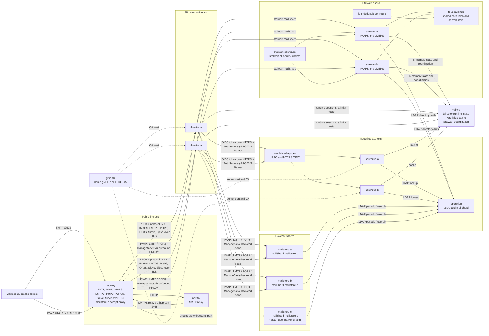

# Nauthilus Director Demo Stack

This stack is a runnable integration playground for the production Director path. The Director image is built from this repository; every other image is pinned through `.env.example`.

## Topology

- HAProxy publishes SMTP, IMAP, IMAPS, LMTPS, POP3, POP3S, Sieve and Sieve-over-TLS on host ports.
- SMTP is handled by HAProxy and Postfix. Postfix relays accepted mail back through HAProxy over LMTPS to the two Director instances.
- IMAP, IMAPS, LMTPS, POP3, POP3S, Sieve and Sieve-over-TLS traffic from HAProxy to the Directors uses the PROXY protocol.
- The Directors own backend selection, health handling, affinity and metrics.
- Nauthilus is intentionally lean in this stack: LDAP/cache identity, a built-in OIDC issuer for Director caller tokens, OpenLDAP-released `mailShard` routing facts and a small Lua environment hook only.
- An internal HAProxy balances Director authority traffic across two Nauthilus instances.
- The Directors obtain Nauthilus-issued OIDC client-credentials tokens over HTTPS through that internal HAProxy, then authenticate to the TLS-protected Nauthilus gRPC AuthService with Bearer caller auth. HTTP Basic Auth is retained only as a disabled compatibility fallback example in the paired configs.
- Three Dovecot 2.4 containers provide IMAPS, LMTPS, POP3 and ManageSieve backend shards. All three use OpenLDAP for passdb/userdb lookups.
- `mailstore-c-imap` is intentionally wired with Director `master_user` backend auth; the other Dovecot IMAP shards use credential replay. ManageSieve backends use Director `master_user` auth so script operations remain backend-owned without retaining frontend passwords.
- `mailstore-c` IMAP, LMTP, POP3 and ManageSieve are reached through internal HAProxy `accept-proxy` frontends, so that shard proves Director-to-backend outbound PROXY protocol while the other Dovecot shards keep the disabled path.
- A FoundationDB-backed Stalwart pair provides an additional `stalwart` backend shard through demo IMAPS and LMTPS listeners.
- The Stalwart instances share FoundationDB for data, blobs and search, and use the demo Valkey service for short-lived in-memory state and cluster coordination.
- Stalwart is configured from the command line: `stalwart-configure` waits for both instances, applies `stalwart/bootstrap.ndjson` through `stalwart-cli`, and then enables the built-in user role for LDAP-backed accounts. No GUI is required or exposed on the host.
- OpenLDAP contains six demo users plus an internal health-check account. Nauthilus, Dovecot and Stalwart all use it as their identity source.


```mermaid
flowchart LR
    client["Mail client / smoke scripts"]

    subgraph ingress["Public ingress"]
        haproxy["haproxy<br/>SMTP, IMAP, IMAPS, LMTPS, POP3, POP3S, Sieve, Sieve-over-TLS<br/>mailstore-c accept-proxy"]
        postfix["postfix<br/>SMTP relay"]
    end

    subgraph directors["Director instances"]
        directorA["director-a"]
        directorB["director-b"]
    end

    subgraph authority["Nauthilus authority"]
        nauthilusProxy["nauthilus-haproxy<br/>gRPC and HTTPS OIDC"]
        nauthilusA["nauthilus-a"]
        nauthilusB["nauthilus-b"]
        openldap["openldap<br/>users and mailShard"]
    end

    subgraph dovecot["Dovecot shards"]
        mailstoreA["mailstore-a<br/>mailShard mailstore-a"]
        mailstoreB["mailstore-b<br/>mailShard mailstore-b"]
        mailstoreC["mailstore-c<br/>mailShard mailstore-c<br/>master-user backend auth"]
    end

    subgraph stalwart["Stalwart shard"]
        stalwartA["stalwart-a<br/>IMAPS and LMTPS"]
        stalwartB["stalwart-b<br/>IMAPS and LMTPS"]
        foundationdb["foundationdb<br/>shared data, blob and search store"]
        fdbConfigure["foundationdb-configure"]
        stalwartConfigure["stalwart-configure<br/>stalwart-cli apply / update"]
    end

    valkey["valkey<br/>Director runtime state<br/>Nauthilus cache<br/>Stalwart coordination"]
    grpcTls["grpc-tls<br/>demo gRPC and OIDC CA"]

    client -->|"SMTP :2525"| haproxy
    client -->|"IMAP :8143 / IMAPS :8993"| haproxy
    haproxy -->|"SMTP"| postfix
    postfix -->|"LMTPS relay via haproxy :2465"| haproxy
    haproxy -->|"PROXY protocol IMAP, IMAPS, LMTPS, POP3, POP3S, Sieve, Sieve-over-TLS"| directorA
    haproxy -->|"PROXY protocol IMAP, IMAPS, LMTPS, POP3, POP3S, Sieve, Sieve-over-TLS"| directorB

    directorA -->|"OIDC token over HTTPS + AuthService gRPC TLS Bearer"| nauthilusProxy
    directorB -->|"OIDC token over HTTPS + AuthService gRPC TLS Bearer"| nauthilusProxy
    nauthilusProxy --> nauthilusA
    nauthilusProxy --> nauthilusB
    nauthilusA -->|"LDAP lookup"| openldap
    nauthilusB -->|"LDAP lookup"| openldap

    directorA -->|"runtime sessions, affinity, health"| valkey
    directorB -->|"runtime sessions, affinity, health"| valkey
    nauthilusA -->|"cache"| valkey
    nauthilusB -->|"cache"| valkey

    directorA -->|"IMAP / LMTP / POP3 / ManageSieve backend pools"| mailstoreA
    directorA -->|"IMAP / LMTP / POP3 / ManageSieve backend pools"| mailstoreB
    directorA -->|"IMAP / LMTP / POP3 / ManageSieve via outbound PROXY"| haproxy
    directorB -->|"IMAP / LMTP / POP3 / ManageSieve backend pools"| mailstoreA
    directorB -->|"IMAP / LMTP / POP3 / ManageSieve backend pools"| mailstoreB
    directorB -->|"IMAP / LMTP / POP3 / ManageSieve via outbound PROXY"| haproxy
    haproxy -->|"accept-proxy backend path"| mailstoreC
    mailstoreA -->|"LDAP passdb / userdb"| openldap
    mailstoreB -->|"LDAP passdb / userdb"| openldap
    mailstoreC -->|"LDAP passdb / userdb"| openldap

    directorA -->|"stalwart mailShard"| stalwartA
    directorA -->|"stalwart mailShard"| stalwartB
    directorB -->|"stalwart mailShard"| stalwartA
    directorB -->|"stalwart mailShard"| stalwartB
    stalwartA -->|"LDAP directory auth"| openldap
    stalwartB -->|"LDAP directory auth"| openldap
    stalwartA --> foundationdb
    stalwartB --> foundationdb
    stalwartA -->|"in-memory state and coordination"| valkey
    stalwartB -->|"in-memory state and coordination"| valkey
    fdbConfigure --> foundationdb
    stalwartConfigure --> stalwartA
    stalwartConfigure --> stalwartB

    grpcTls -.->|"server cert and CA"| nauthilusA
    grpcTls -.->|"server cert and CA"| nauthilusB
    grpcTls -.->|"CA trust"| directorA
    grpcTls -.->|"CA trust"| directorB
```

## Demo Users

All users use the password `demo-secret`.

| User | Shard |
| --- | --- |
| `alice@example.test` | `mailstore-a` |
| `bob@example.test` | `mailstore-b` |
| `carol@example.test` | `mailstore-c` |
| `dave@example.test` | `mailstore-a` |
| `erin@example.test` | `stalwart` |
| `frank@example.test` | `stalwart` |

`healthcheck@example.test` is an internal backend health-check identity and is not meant for client smoke tests.

## Run

```bash
cd contrib/demo-stack
cp .env.example .env
docker compose up --build -d
```

The default Stalwart Docker image does not include FoundationDB support. The
demo therefore builds the Stalwart containers from the upstream
`Dockerfile.fdb` build context named by `STALWART_FDB_BUILD_CONTEXT` in `.env`.
The example environment pins that build context to the Stalwart commit currently
validated by this stack, because moving branches can change the generated image
without a repository diff.
The first `docker compose up --build -d` can take a long time, especially on
older machines, because this compiles the FoundationDB-enabled Stalwart image.
That first build can look quiet for several minutes. Later starts reuse the
Docker build cache unless the Stalwart build context or Dockerfile changes.

The official Dovecot image ships with a static test passdb. This demo replaces
that with `dovecot/auth.conf`, which binds Dovecot to OpenLDAP for user
authentication, LMTP recipient lookup, POP3 login and ManageSieve login. `mailstore-c-imap` uses the Director
master user `nauthilus-director` with `DOVECOT_MASTER_PASSWORD`; `mailstore-a`
and `mailstore-b` keep the IMAP credential-replay path. ManageSieve backends
use the same Dovecot master-user identity on all three shards.

The Stalwart LMTPS listener is used only as an internal backend in this demo.
Its bootstrap plan allows unauthenticated internal LMTP delivery on that
listener and disables spam filtering there, while IMAPS authentication still
uses OpenLDAP. Director-side Stalwart backend health checks are intentionally
disabled because generic IMAP probes would not be a clean availability proof for
LDAP-backed demo accounts; container health plus the send/fetch smoke tests
cover that shard.

Useful host ports:

| Service | Host port |
| --- | --- |
| SMTP through HAProxy/Postfix | `2525` |
| IMAP through HAProxy/Director | `8143` |
| IMAPS through HAProxy/Director | `8993` |
| LMTPS through HAProxy/Director | `8024` |
| POP3 through HAProxy/Director | `8110` |
| POP3S through HAProxy/Director | `8995` |
| Sieve STARTTLS through HAProxy/Director | `4190` |
| Sieve-over-TLS through HAProxy/Director | `8490` |
| HAProxy stats | `8404` |
| Director A control API | `9090` |
| Director B control API | `9091` |

The Director control API is HTTPS-only when accessed through the published host
ports. The proof scripts default to `https://127.0.0.1:9090` and trust the
ephemeral demo certificate only for local proof traffic.

## Smoke Test

```bash
./scripts/send-mail.sh alice@example.test
./scripts/fetch-mail.sh alice@example.test
```

The scripts also accept the other demo users. To keep the demo simple, frontend and backend TLS certificates are self-signed and the test fetcher disables certificate verification.
The stack also generates an internal demo CA for Director-to-Nauthilus gRPC TLS, the internal HTTPS OIDC issuer and an OIDC signing key in the `grpc-tls` volume. HAProxy terminates HTTPS for OIDC discovery/token requests and passes gRPC TLS through to the selected Nauthilus instance. Director containers trust the demo CA through `SSL_CERT_FILE`.
Because the demo Director config enables OIDC caller auth and disables gRPC Basic caller auth, every successful smoke script proves the public mail path can authenticate users while Director-to-Nauthilus authority calls use Nauthilus-issued Bearer tokens.

The demo also includes public-boundary affinity proofs:

```bash
./scripts/prove-affinity.sh
./scripts/prove-backend-proxy.sh
./scripts/prove-managesieve.sh
./scripts/prove-pop3.sh
./scripts/prove-user-backend-pin.sh
./scripts/prove-user-hold.sh
```

`prove-affinity.sh` opens one IMAPS session for `alice@example.test`, injects a
message through the public SMTP to LMTP delivery path, opens follow-up IMAPS
sessions while the first session is still active, and verifies through the
Director control API that all IMAP sessions stay on the same backend.
`prove-backend-proxy.sh` pins `carol@example.test` to `mailstore-c-imap` and
repeats the same public IMAPS plus SMTP/LMTP proof through the demo HAProxy
`accept-proxy` path. Without Director outbound PROXY protocol, that shard's
IMAP and LMTP backend connections cannot complete.
`prove-managesieve.sh` authenticates `alice@example.test` through the public
Sieve STARTTLS and Sieve-over-TLS ports, then proves `LISTSCRIPTS`,
`PUTSCRIPT`, `SETACTIVE` and `GETSCRIPT` through the real Dovecot
ManageSieve backend while checking that route lookup does not expose script
material.
`prove-pop3.sh` injects a message through the public SMTP-to-LMTPS path,
authenticates `alice@example.test` through public POP3 STLS and POP3S, proves
`STAT`, `LIST`, `UIDL`, `RETR` and `QUIT` through the real Dovecot POP3
backend, and checks that POP3 route lookup does not expose message material.
`prove-user-backend-pin.sh` sets a runtime backend pin for `dave@example.test`
to `mailstore-a-imap`, repeats the same IMAPS plus SMTP/LMTP proof, and clears
the pin afterwards. Set `DEMO_KEEP_BACKEND_PIN=1` to leave the runtime pin in
place after the proof. The affinity and backend-pin scripts accept the same
host and credential environment overrides as the smoke scripts, plus
`DEMO_CONTROL_URL`, `DEMO_USER`, `DEMO_PIN_BACKEND` and
`DEMO_FOLLOWUP_COUNT`.
`prove-user-hold.sh` sets a temporary placement hold for `bob@example.test`,
starts a public IMAPS login that must wait without creating a runtime session,
checks route lookup hold diagnostics, applies a backend pin as the migration
target inside the user's shard, clears only the hold, and verifies the waiting
login resumes on the target backend. It accepts `DEMO_HOLD_DURATION_SECONDS`,
`DEMO_HOLD_PROBE_SECONDS`, `DEMO_HOLD_TARGET_BACKEND`,
`DEMO_KEEP_BACKEND_PIN`, `DEMO_CONTROL_URL` and the same host and credential
overrides as the other proof scripts.

The deterministic repository proof for missing or insufficient OIDC caller
auth is `make e2e`, and the real Dovecot/Postfix interoperability proof is
`make e2e-interop` on a Docker-capable host. Both lanes use public sockets and
record that the fake Nauthilus authority saw Bearer caller auth instead of
Basic Auth.

The Stalwart pair is initialized from the command line by a one-shot Compose service. The same plan configures Stalwart storage to use the shared FoundationDB cluster file mounted at `/var/fdb/fdb.cluster`:

```bash
docker compose run --rm stalwart-configure
```

Normally `docker compose up --build -d` runs that service before the Directors start. The included FoundationDB service is a single-node demo store; production-like HA would use a real multi-process or multi-host FoundationDB deployment while keeping the same Stalwart cluster-file contract. If you change the LDAP schema, LDAP bootstrap data, generated FoundationDB cluster file or Stalwart bootstrap plan after the first run, recreate the demo volumes with `docker compose down -v` before starting the stack again.

## Runtime State Reset

The demo uses Redis schema version `1` with the development-stage runtime key layout. It is not a published production compatibility contract and this stack is not sized or tuned as a million-session load environment.

If an older demo run left incompatible runtime keys behind, stop the Directors and either let the short-lived session and reservation leases expire, or clear the isolated demo Valkey database explicitly:

```bash
docker compose stop director-a director-b
docker compose exec valkey valkey-cli FLUSHDB
docker compose up -d director-a director-b
```

`docker compose down -v` also recreates demo-only state when you want a completely clean lab. Do not use these reset commands against a Redis database that carries active production sessions.

## Inspect

```bash
docker compose ps
docker compose logs -f foundationdb foundationdb-configure director-a director-b nauthilus-a nauthilus-b nauthilus-haproxy stalwart-a stalwart-b stalwart-configure
docker compose exec director-a nauthilus-directorctl --address https://127.0.0.1:9090 --tls-ca-file /run/nauthilus-director/tls/server.crt status
```

## Stop

```bash
docker compose down -v
```
