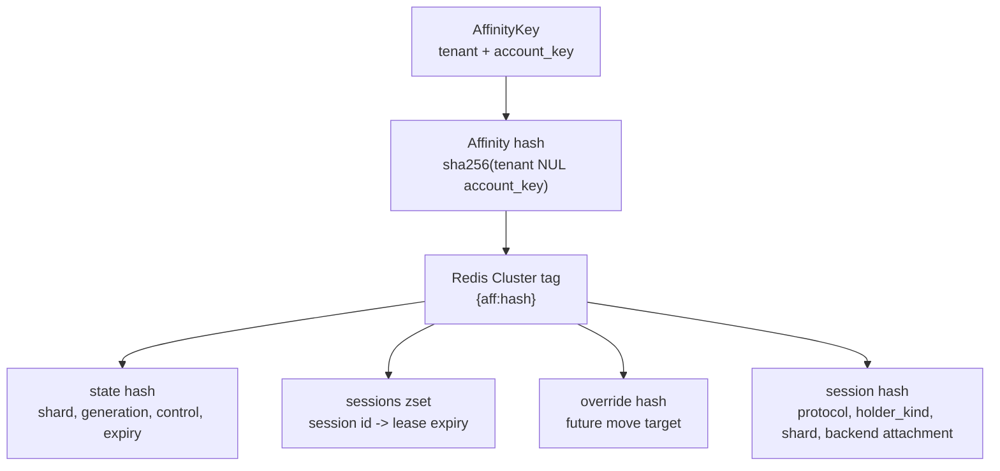
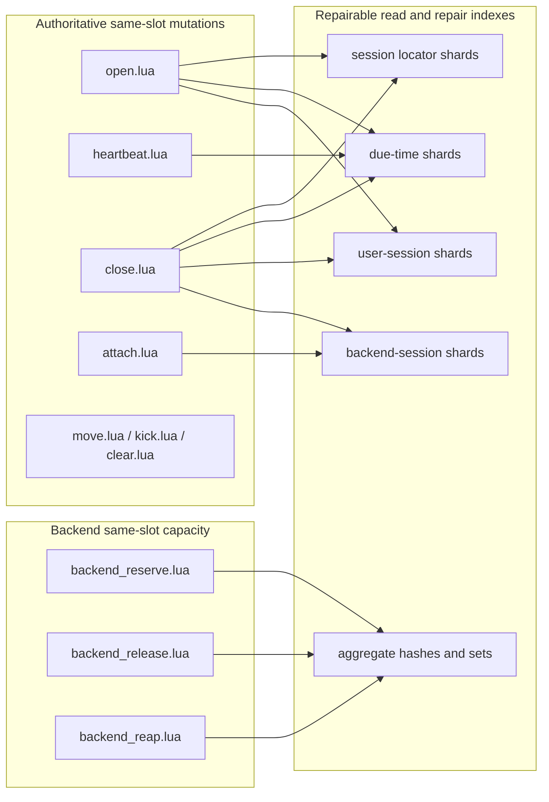
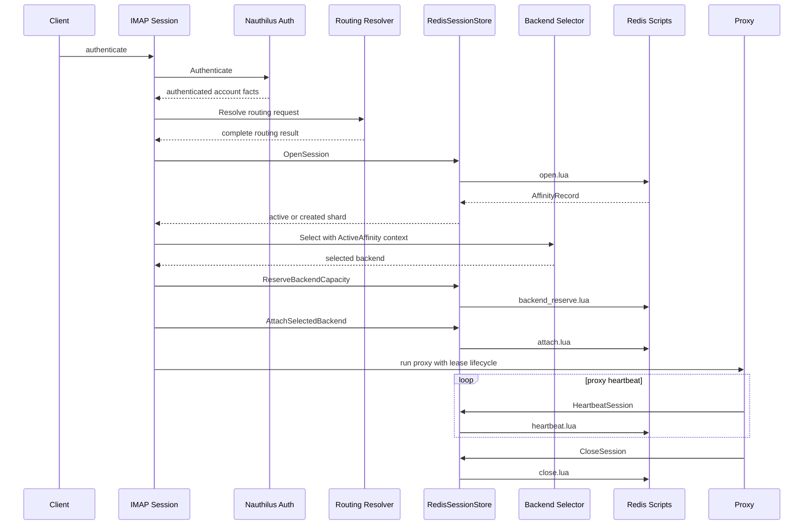
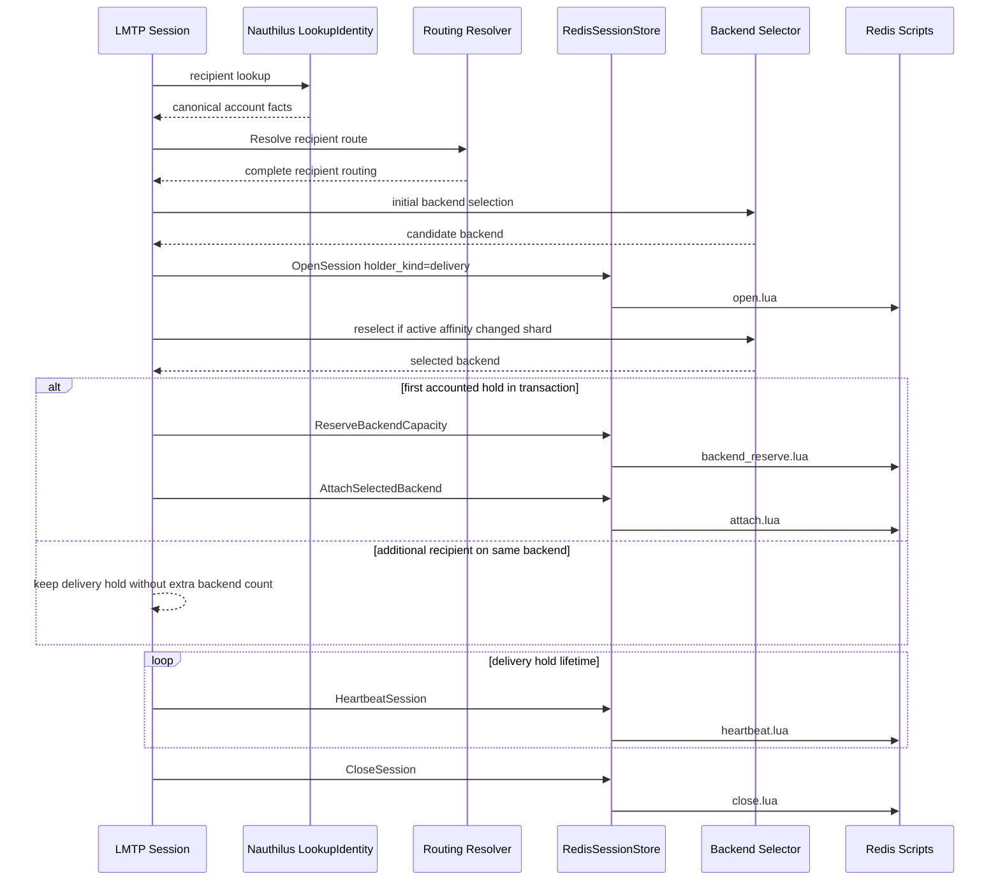
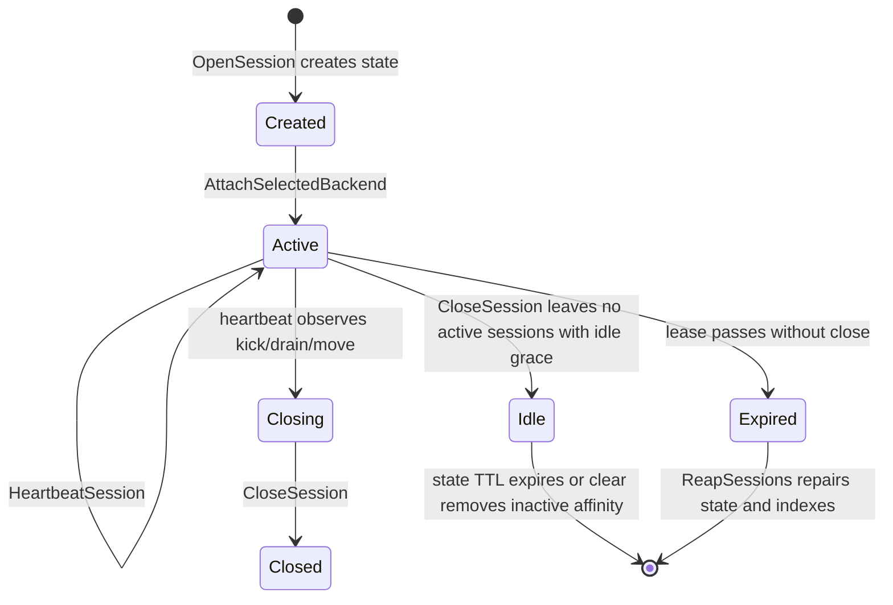
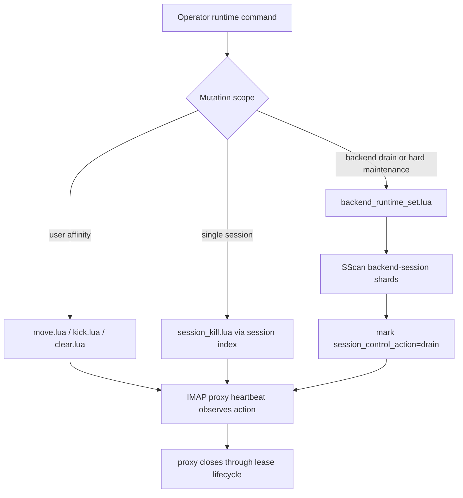
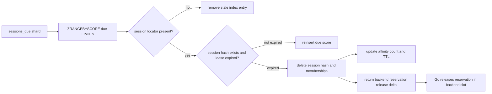

# Affinity and Session Handling

This developer reference describes the current affinity and session behavior as
implemented in code. It is intentionally descriptive: when any of the source
paths below change, update this document in the same change.

Verified source paths:

- `internal/state/affinity.go`
- `internal/state/keys.go`
- `internal/state/sessions.go`
- `internal/state/runtime.go`
- `internal/state/runtime_read.go`
- `internal/state/reap.go`
- `internal/state/backend_reservations.go`
- `internal/state/scripts/*.lua`
- `internal/protocol/imap/placement.go`
- `internal/protocol/lmtp/placement.go`
- `internal/backend/selector.go`
- `internal/backend/runtime.go`
- `internal/backend/runtime_selector.go`
- `internal/runtime/route_lookup.go`
- `internal/runtime/sessions.go`

## Core Model

Affinity is keyed by `state.AffinityKey`:

```text
tenant + account_key
```

The key identifies an account-level runtime affinity without storing a raw
username in Redis key names. `KeyBuilder.AffinityHash` hashes the normalized
tenant and account key as `sha256(tenant + NUL + account_key)`.

The authoritative user-level pin is the shard tag in `AffinityRecord.ShardTag`.
Concrete backend identity is stored on attached session records and backend
reservation state. The current Redis affinity scripts return an empty
`backend_id` for affinity lookup/open responses; `PinnedBackendIdentifier`
exists in the selector request type, but the user-affinity record does not
currently store a backend id.

`SessionRecord` represents one lease-backed holder under an affinity key. The
code uses two holder kinds:

- `session`: a mailbox login session, visible through runtime session APIs.
- `delivery`: an LMTP delivery-scoped hold, hidden from runtime session APIs.



## Redis Key Families

Per-affinity keys share one Redis Cluster hash tag:

```text
<prefix>:v<schema>:{aff:<affinity_hash>}:state
<prefix>:v<schema>:{aff:<affinity_hash>}:sessions
<prefix>:v<schema>:{aff:<affinity_hash>}:override
<prefix>:v<schema>:{aff:<affinity_hash>}:session:<session_id>
```

Backend capacity reservations use a separate same-slot key group per backend:

```text
<prefix>:v<schema>:{backend:<backend_hash>}:runtime:backend:<backend_id>:reservations
<prefix>:v<schema>:{backend:<backend_hash>}:runtime:backend:<backend_id>:reservations_due
```

Runtime listing and repair keys are secondary, repairable indexes:

```text
<prefix>:v<schema>:idx:sessions:<shard>
<prefix>:v<schema>:idx:sessions_due:<shard>
<prefix>:v<schema>:idx:users:<shard>
<prefix>:v<schema>:idx:user:<affinity_hash>:sessions:<shard>
<prefix>:v<schema>:idx:backend:<backend_id>:sessions:<shard>
<prefix>:v<schema>:idx:backends
<prefix>:v<schema>:runtime:aggregates:*
```

`KeyBuilder` validates same-tag affinity script keys and same-tag backend
reservation script keys. Secondary index writes are recorded as
non-authoritative follow-up Redis writes and are repaired by runtime reads and
the reaper.



## IMAP Login Session Flow

IMAP placement lives in `internal/protocol/imap/placement.go`.

1. `authenticateAndPlace` authenticates frontend credentials through the
   configured Nauthilus authority.
2. `placeAuthenticatedSession` builds a side-effect-free routing request from
   authenticated account facts.
3. Missing route shard is filled from the immutable session context default.
   Incomplete routing fails before session state is opened.
4. `sessionStore.OpenSession` opens or reuses the Redis affinity lease.
5. The selected shard is the active affinity shard when present; otherwise it
   is the routing result shard.
6. Backend selection receives `ActiveAffinity` and the effective shard.
7. Backend capacity is reserved before the selected backend is attached to the
   session.
8. If backend selection or attach fails after open, the opened session is
   closed as rollback.
9. Proxy mode heartbeats the Redis lease and closes it when proxying ends.



`sessionLeaseLifecycle.Heartbeat` converts heartbeat control actions
`kick`, `drain` and `move_generation_changed` into proxy control errors. The
proxy lifecycle then closes the session through `CloseSession`.

## LMTP Delivery Holds

LMTP recipient placement lives in `internal/protocol/lmtp/placement.go`. It is
only used when recipient placement is required for the session.

For each accepted recipient that needs placement, `openRecipientHold` opens a
delivery-scoped holder:

- `deliverySessionRecord` sets `HolderKindDelivery` and protocol `lmtp`.
- The hold uses the same affinity key model as login sessions.
- `startDeliveryHeartbeat` refreshes the hold until it is closed.
- Runtime session reads hide delivery holds by checking `holder_kind`.

Unlike the IMAP proxy lease lifecycle, `heartbeatDeliveryHold` does not convert
heartbeat control actions into an immediate stream close. Delivery holds are
closed by the LMTP transaction lifecycle or, if they are abandoned, by lease
expiry and reaper repair.

The transaction accounts backend capacity through one delivery hold only:

- `accountRecipientBackend` returns without attaching when another hold already
  accounted the transaction backend.
- `attachSelectedBackend` reserves backend capacity before attach and releases
  the reservation on attach failure.
- `handleRecipientPlacement` rejects a transaction whose accepted recipients do
  not agree on one backend identifier.
- `closeTransactionHolds` releases all accepted recipient holds.



## Open, Heartbeat and Close

`open.lua`:

- uses Redis server time,
- removes expired members from the per-affinity sessions zset,
- creates state when no active state exists,
- reuses the existing shard when affinity is active,
- applies pending move overrides for future sessions,
- rejects protocol or shard conflicts for an existing session id,
- writes the session hash and updates state/session TTLs.

`heartbeat.lua`:

- requires state, session hash and a non-expired zset score,
- extends the session lease and state expiry with Redis server time,
- detects session-specific and affinity-wide control generations,
- returns the observed control action without applying routing decisions in the
  protocol handler,
- refreshes the backend reservation when the session is counted.

`close.lua`:

- removes the session from the per-affinity zset and deletes the session hash,
- keeps the affinity state while other active sessions exist,
- keeps idle affinity state until idle grace expires when no active sessions
  remain and idle grace is positive,
- deletes affinity state and sessions zset immediately when no sessions remain
  and idle grace is zero,
- returns backend reservation metadata so the Go store can release capacity.



## Backend Capacity and Attachment

Capacity is reserved before the session is attached to a backend:

1. `ReserveBackendCapacity` runs `backend_reserve.lua` in the backend
   reservation key group.
2. The reservation is idempotent for an existing reservation id.
3. New reservations fail closed when `active_session_count >= max_connections`.
4. `AttachSelectedBackend` runs `attach.lua` in the affinity key group.
5. Attach is idempotent for the same backend and reservation id.
6. Attach rejects conflicting backend or reservation values.
7. If attach fails after reserve, the protocol placement code releases the
   reservation.

The backend reservation keys live in a different Redis Cluster slot than the
affinity keys. The code therefore does not try to mutate backend reservations
from affinity scripts. Close and reaper paths return or derive release deltas
and then call reservation release functions from Go.

## Runtime Controls

Runtime user mutations in `internal/state/runtime.go` use same-slot affinity
scripts:

- `MoveUser` stores one of `new_sessions_only`, `kick_existing` or
  `drain_existing`.
- `KickUser` increments affinity control generation and marks the affinity for
  heartbeat-observed closure.
- `ClearUserAffinity` clears inactive affinity and override state, and requires
  an explicit flag to clear active affinity.

Session and backend controls use repairable indexes:

- `KillSession` looks up the session through its session-index shard and writes
  a session-local `kick` control action.
- `SetBackendRuntime` writes backend runtime override state. Hard maintenance
  or enabled drain walks backend-session index shards with `SScan` and marks
  indexed sessions with `drain`.
- `SessionService.KillSession` also asks `LocalSessionRegistry` to close a
  locally owned stream when the current process has it. The local registry is
  only an acceleration index and does not own global state.



## Reaper and Repair

`ReapSessions` is bounded by `ReapRequest.Limit` and optionally by
`MaxPassDuration`. It walks due-time session index shards and calls `reap.lua`
with the remaining limit for each shard.

`reap.lua`:

- reads due sessions with `ZRANGEBYSCORE ... LIMIT`,
- removes stale session locator and due-index entries,
- checks the session hash lease timestamp before expiring it,
- removes user-session and backend-session membership when metadata exists,
- updates or deletes affinity state according to remaining active sessions and
  idle grace,
- returns backend reservation release deltas because reservation keys live in a
  separate Redis Cluster slot,
- returns aggregate repair work for the Go store to apply.

After session repair, `ReapSessions` also repairs indexed backend reservations
with bounded backend reservation reaps.



## Runtime Reads and Route Lookup

Runtime session and user lists are cursor-paginated:

- `ListRuntimeSessionsPage` uses sharded session locators and `HScan`.
- `ListRuntimeSessionsForUserPage` and
  `ListRuntimeSessionsForBackendPage` use sharded membership sets and `SScan`.
- `ListRuntimeUsersPage` uses sharded user indexes and `HScan`.
- Cursors are opaque base64 JSON payloads with version, family, shard, Redis
  cursor and optional offset.
- Delivery holders are filtered out by `readRuntimeSession` when
  `holder_kind == delivery`.

`LookupAffinity` runs `lookup.lua`, which reads state without refreshing leases
or key TTLs. `RouteLookupService.Lookup` is a diagnostic path: it resolves
identity/routing information, optionally reads active affinity, and explains
backend selection without opening, heartbeating, closing or attaching sessions.
For LMTP route diagnostics with a recipient and no supplied account key, route
lookup first tries an existing active affinity for the normalized recipient
lookup name, then falls back to the configured identity lookup.

## Developer Rules

- Open, heartbeat and close sessions only through `state.SessionStore`.
- Reserve backend capacity before `AttachSelectedBackend`.
- Release backend reservations after attach failure or close.
- Treat secondary indexes and aggregates as repairable, not authoritative.
- Do not add routing decisions to Nauthilus-facing auth or identity calls.
- Do not expose `delivery` holders through runtime session listings.
- Keep new runtime reads cursor-bounded and shard-aware.
- Do not store raw usernames, session secrets or bearer material in Redis key
  names, logs, metrics labels or operator output.
