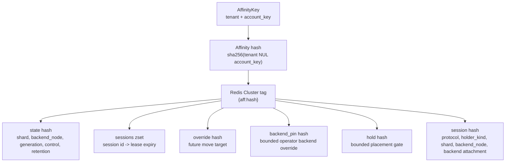
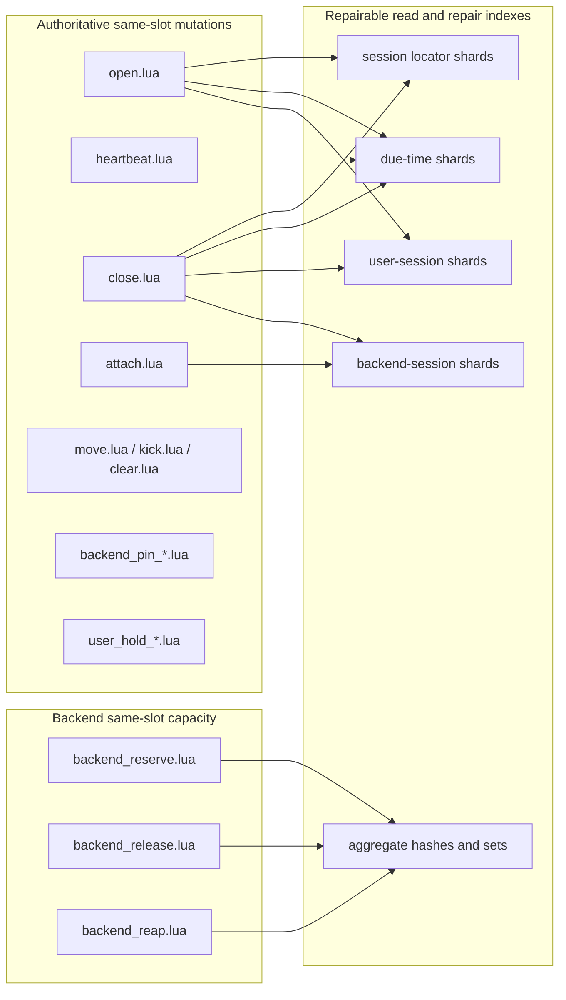
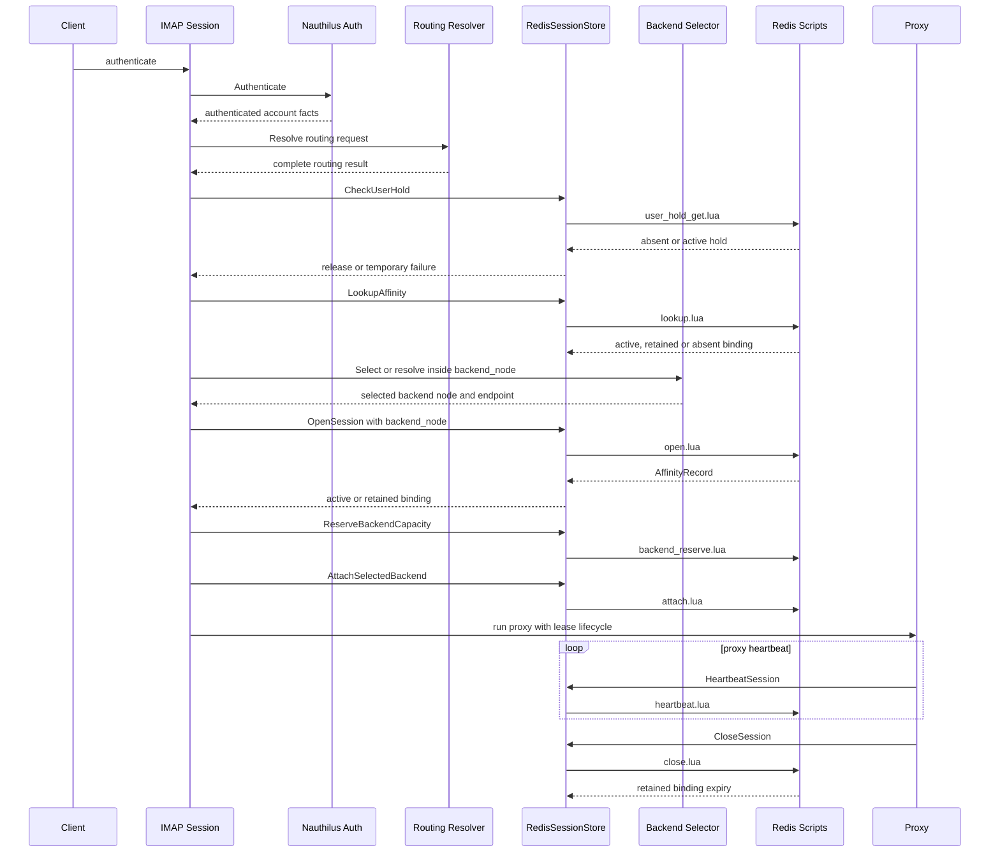
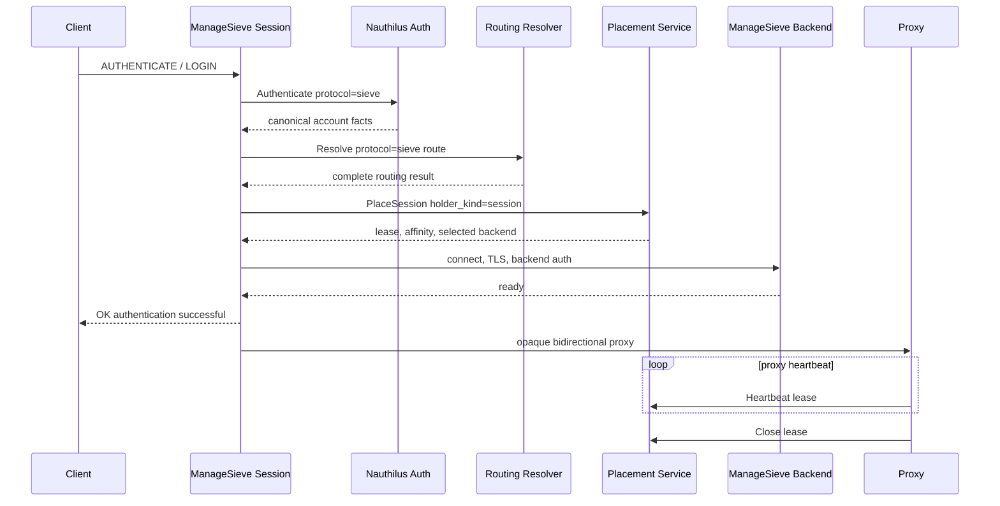
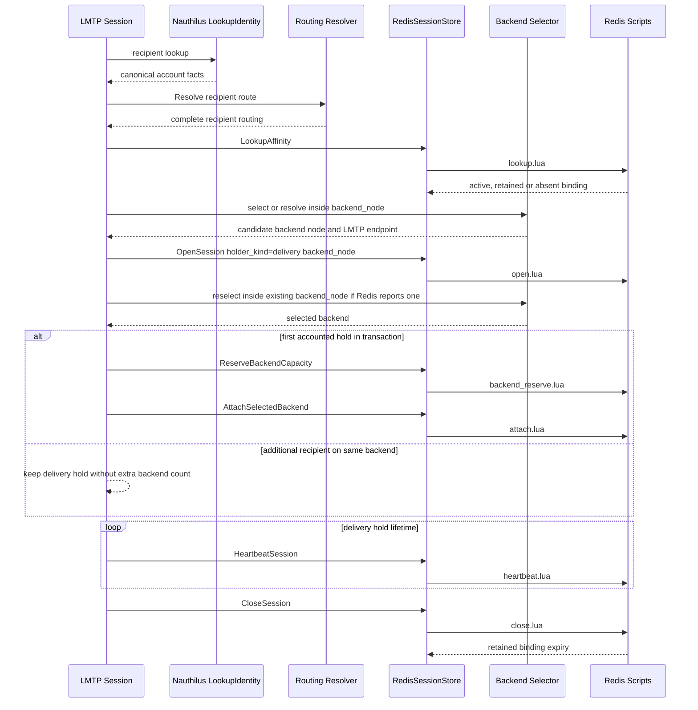
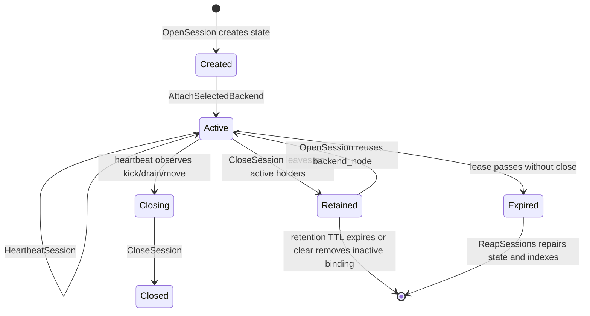
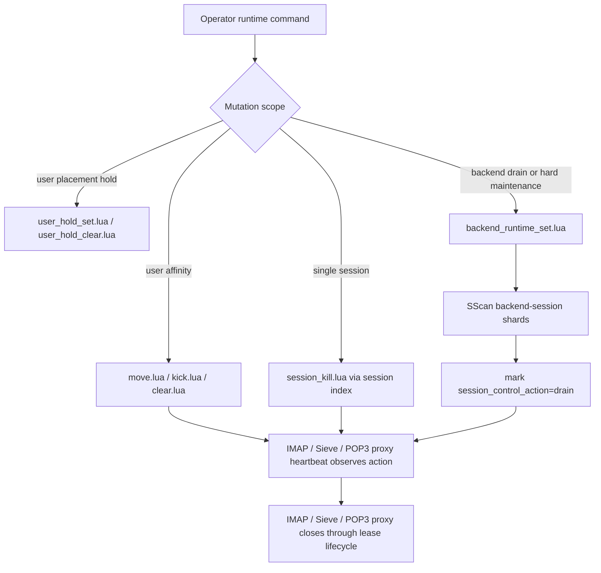
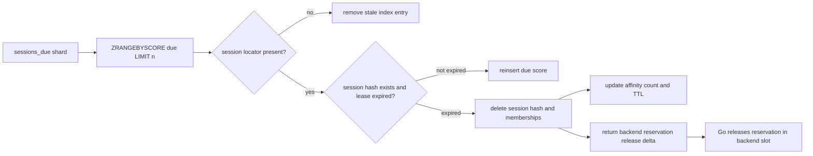

# Affinity and Session Handling

This developer reference describes the current affinity and session behavior as
implemented in code. It is intentionally descriptive: when any of the source
paths below change, update this document in the same change.

Verified source paths:

- `internal/state/affinity.go`
- `internal/state/keys.go`
- `internal/state/sessions.go`
- `internal/state/runtime.go`
- `internal/state/runtime_read.go`
- `internal/state/reap.go`
- `internal/state/backend_reservations.go`
- `internal/state/scripts/*.lua`
- `internal/protocol/imap/placement.go`
- `internal/protocol/lmtp/placement.go`
- `internal/protocol/sieve/session.go`
- `internal/protocol/sieve/placement.go`
- `internal/protocol/sieve/proxy.go`
- `internal/protocol/pop3/session.go`
- `internal/protocol/pop3/auth.go`
- `internal/protocol/pop3/placement.go`
- `internal/protocol/pop3/proxy.go`
- `internal/backend/selector.go`
- `internal/backend/runtime.go`
- `internal/backend/runtime_selector.go`
- `internal/runtime/route_lookup.go`
- `internal/runtime/sessions.go`

## Core Model

Affinity is keyed by `state.AffinityKey`:

```text
tenant + account_key
```

The key identifies an account-level runtime affinity without storing a raw
username in Redis key names. `KeyBuilder.AffinityHash` hashes the normalized
tenant and account key as `sha256(tenant + NUL + account_key)`.

The authoritative user-level binding is the shard tag plus backend node stored
in `AffinityRecord.ShardTag` and `AffinityRecord.BackendNode`. The shard tag is
the logical placement and failover boundary; the backend node is the concrete
mailstore authority that protects mailbox-index consistency across IMAP, LMTP,
ManageSieve and later POP3. Concrete protocol endpoint identity remains on
attached session records and backend reservation state. Operator backend pins
use a separate per-affinity `backend_pin` hash under the same Redis Cluster hash
tag. Operator placement holds use a separate per-affinity `hold` hash that
gates future placement without choosing a shard or backend. The user-affinity
record stores only bounded binding facts, not backend transport details.

`SessionRecord` represents one lease-backed holder under an affinity key. The
code uses two holder kinds:

- `session`: a mailbox login session, visible through runtime session APIs.
- `delivery`: an LMTP delivery-scoped hold, hidden from runtime session APIs.


```mermaid
flowchart TB
    A["AffinityKey<br/>tenant + account_key"] --> H["Affinity hash<br/>sha256(tenant NUL account_key)"]
    H --> G["Redis Cluster tag<br/>{aff:hash}"]
    G --> S["state hash<br/>shard, backend_node, generation, control, retention"]
    G --> Z["sessions zset<br/>session id -> lease expiry"]
    G --> O["override hash<br/>future move target"]
    G --> P["backend_pin hash<br/>bounded operator backend override"]
    G --> Q["hold hash<br/>bounded placement gate"]
    G --> K["session hash<br/>protocol, holder_kind, shard, backend_node, backend attachment"]
```

## Redis Key Families

Per-affinity keys share one Redis Cluster hash tag:

```text
<prefix>:v<schema>:{aff:<affinity_hash>}:state
<prefix>:v<schema>:{aff:<affinity_hash>}:sessions
<prefix>:v<schema>:{aff:<affinity_hash>}:override
<prefix>:v<schema>:{aff:<affinity_hash>}:backend_pin
<prefix>:v<schema>:{aff:<affinity_hash>}:hold
<prefix>:v<schema>:{aff:<affinity_hash>}:session:<session_id>
```

`backend_pin` is the authoritative concrete backend override for one affinity
key. It stores only bounded selector facts derived from the configured backend
registry: tenant, account key, backend identifier, protocol, backend pool,
effective shard, strategy, generation, reason, actor and update timestamp. It
does not store backend addresses, credentials, TLS material, private key paths
or raw usernames in Redis key names.

`hold` is the authoritative operator placement gate for one affinity key. It
stores tenant, account key, generation, Redis-server `created_at_ms`,
`expires_at_ms`, requested duration, reason, actor and update timestamp. It does
not store target shard, backend identity, backend transport details, credentials,
session identifiers or raw usernames in Redis key names. Expired hold hashes
read as absent even when their cleanup TTL has not removed the physical hash.

Backend-pin mutations use the same per-affinity key group as user movement:

- `backend_pin_set.lua` writes only the `backend_pin` hash in the authoritative
  same-slot mutation. It does not create a shard override and does not change
  active shard affinity. With `kick_existing`, the script increments the active
  control generation so heartbeats observe `move_generation_changed` and close
  existing sessions through the controlled runtime path.
- `backend_pin_get.lua` reads the pin hash and active-session count without
  refreshing leases or mutating affinity state.
- `backend_pin_clear.lua` deletes only `backend_pin`. It preserves active
  sessions, shard affinity and any pending shard override.
- `user_hold_set.lua` writes the `hold` hash with Redis-server timestamps and a
  cleanup TTL. It rejects non-positive durations and durations above the
  caller-provided maximum.
- `user_hold_get.lua` reads the hold hash without refreshing, clearing or
  consuming it. It reports expired hashes as absent.
- `user_hold_clear.lua` deletes only `hold`. It preserves active sessions,
  delivery holds, shard affinity, movement overrides, backend pins and backend
  reservations.

Backend capacity reservations use a separate same-slot key group per backend:

```text
<prefix>:v<schema>:{backend:<backend_hash>}:runtime:backend:<backend_id>:reservations
<prefix>:v<schema>:{backend:<backend_hash>}:runtime:backend:<backend_id>:reservations_due
```

Runtime listing and repair keys are secondary, repairable indexes:

```text
<prefix>:v<schema>:idx:sessions:<shard>
<prefix>:v<schema>:idx:sessions_due:<shard>
<prefix>:v<schema>:idx:users:<shard>
<prefix>:v<schema>:idx:user:<affinity_hash>:sessions:<shard>
<prefix>:v<schema>:idx:backend:<backend_id>:sessions:<shard>
<prefix>:v<schema>:idx:backends
<prefix>:v<schema>:runtime:aggregates:*
```

`KeyBuilder` validates same-tag affinity script keys and same-tag backend
reservation script keys. Secondary index writes are recorded as
non-authoritative follow-up Redis writes and are repaired by runtime reads and
the reaper.


```mermaid
flowchart LR
    subgraph "Authoritative same-slot mutations"
        A1["open.lua"]
        A2["heartbeat.lua"]
        A3["close.lua"]
        A4["attach.lua"]
        A5["move.lua / kick.lua / clear.lua"]
        A6["backend_pin_*.lua"]
        A7["user_hold_*.lua"]
    end

    subgraph "Backend same-slot capacity"
        B1["backend_reserve.lua"]
        B2["backend_release.lua"]
        B3["backend_reap.lua"]
    end

    subgraph "Repairable read and repair indexes"
        I1["session locator shards"]
        I2["due-time shards"]
        I3["user-session shards"]
        I4["backend-session shards"]
        I5["aggregate hashes and sets"]
    end

    A1 --> I1
    A1 --> I2
    A1 --> I3
    A4 --> I4
    A2 --> I2
    A3 --> I1
    A3 --> I2
    A3 --> I3
    A3 --> I4
    B1 --> I5
    B2 --> I5
    B3 --> I5
```

## IMAP Login Session Flow

IMAP placement lives in `internal/protocol/imap/placement.go`.

1. `authenticateAndPlace` authenticates frontend credentials through the
   configured Nauthilus authority.
2. `placeAuthenticatedSession` builds a side-effect-free routing request from
   authenticated account facts.
3. Missing route shard is filled from the immutable session context default.
   Incomplete routing fails before session state is opened.
4. The shared placement gate reads any active user hold after identity
   resolution and before backend selection, session open, backend reservation
   or backend connect. If the hold clears or expires within `max_wait`, the
   login continues and re-reads runtime state; otherwise the protocol returns a
   temporary failure without opening placement state.
5. The shared placement service reads active or retained affinity and any
   scoped backend pin before it selects a backend.
6. Existing active or retained affinity selects the bound backend node. Without
   an authoritative binding, initial placement selects a backend in the routed
   shard and atomically persists that backend node before backend side effects.
7. A matching backend pin can pass a concrete backend target only when the
   pin's protocol, backend pool, shard and backend node agree with the current
   placement request. It never silently changes an active or retained backend
   node.
8. Backend selection resolves the requested protocol endpoint inside the bound
   backend node. Missing protocol entries, unusable node-local entries and
   backend-node mismatches fail closed unless an explicit audited movement path
   applies.
9. Backend capacity is reserved before the selected backend is attached to the
   session.
10. If backend selection or attach fails after open, the opened session is
   closed as rollback.
11. Proxy mode heartbeats the Redis lease and closes it when proxying ends.
   Closing the final holder leaves a retained backend-node binding for the
   configured backend-retention window.


```mermaid
sequenceDiagram
    participant Client
    participant IMAP as IMAP Session
    participant Auth as Nauthilus Auth
    participant Routing as Routing Resolver
    participant Store as RedisSessionStore
    participant Selector as Backend Selector
    participant Redis as Redis Scripts
    participant Proxy

    Client->>IMAP: authenticate
    IMAP->>Auth: Authenticate
    Auth-->>IMAP: authenticated account facts
    IMAP->>Routing: Resolve routing request
    Routing-->>IMAP: complete routing result
    IMAP->>Store: CheckUserHold
    Store->>Redis: user_hold_get.lua
    Redis-->>Store: absent or active hold
    Store-->>IMAP: release or temporary failure
    IMAP->>Store: LookupAffinity
    Store->>Redis: lookup.lua
    Redis-->>Store: active, retained or absent binding
    IMAP->>Selector: Select or resolve inside backend_node
    Selector-->>IMAP: selected backend node and endpoint
    IMAP->>Store: OpenSession with backend_node
    Store->>Redis: open.lua
    Redis-->>Store: AffinityRecord
    Store-->>IMAP: active or retained binding
    IMAP->>Store: ReserveBackendCapacity
    Store->>Redis: backend_reserve.lua
    IMAP->>Store: AttachSelectedBackend
    Store->>Redis: attach.lua
    IMAP->>Proxy: run proxy with lease lifecycle
    loop proxy heartbeat
        Proxy->>Store: HeartbeatSession
        Store->>Redis: heartbeat.lua
    end
    Proxy->>Store: CloseSession
    Store->>Redis: close.lua
    Redis-->>Store: retained binding expiry
```

`sessionLeaseLifecycle.Heartbeat` converts heartbeat control actions
`kick`, `drain` and `move_generation_changed` into proxy control errors. The
proxy lifecycle then closes the session through `CloseSession`.

## ManageSieve Session Flow

ManageSieve placement lives in `internal/protocol/sieve/placement.go`. Proxy
handoff and lease heartbeats live in `internal/protocol/sieve/proxy.go`.

ManageSieve uses the canonical protocol value `sieve` for routing, placement,
runtime state, route lookup and metrics. Listener or service names such as
`sieve` and `sieves` are transport-facing names only.

Authenticated ManageSieve sessions use the same shared placement boundary as
IMAP:

1. `placeAuthenticatedSession` runs only after the frontend authentication
   command has been accepted by Nauthilus.
2. The routing request is built from canonical auth facts. The client-supplied
   authorization identity is diagnostic input, not the affinity key.
3. Missing route shard is filled from the listener default. Incomplete routing
   fails before runtime state is opened.
4. The shared placement gate checks user holds before placement reads, backend
   selection, backend reservation or backend connect.
5. `placement.SessionPlacer.PlaceSession` opens a `holder_kind=session` record
   with protocol `sieve`, applies active or retained backend-node affinity,
   scoped backend pins, movement overrides, backend health, maintenance,
   runtime overrides and capacity reservation, and attaches the selected backend.
6. `transitionAuthenticatedSession` connects to the selected ManageSieve
   backend and completes configured backend authentication before the frontend
   receives authentication success.
7. If backend access or the frontend success write fails, `closePlacedSession`
   rolls the lease back and releases the backend reservation through the shared
   close path.
8. After frontend success, `BufferedProxyHandoff` carries any read-ahead bytes
   into opaque proxy mode. The director does not parse or log post-auth
   ManageSieve script commands, literals or script names for routing.
9. `placementLeaseLifecycle.Heartbeat` refreshes the Redis lease during proxy
   mode and converts `kick`, `drain` and `move_generation_changed` into proxy
   control errors. `Close` releases the lease when proxying ends.
10. Closing the final ManageSieve holder leaves a retained backend-node binding
    for the configured backend-retention window.


```mermaid
sequenceDiagram
    participant Client
    participant Sieve as ManageSieve Session
    participant Auth as Nauthilus Auth
    participant Routing as Routing Resolver
    participant Placer as Placement Service
    participant Backend as ManageSieve Backend
    participant Proxy

    Client->>Sieve: AUTHENTICATE / LOGIN
    Sieve->>Auth: Authenticate protocol=sieve
    Auth-->>Sieve: canonical account facts
    Sieve->>Routing: Resolve protocol=sieve route
    Routing-->>Sieve: complete routing result
    Sieve->>Placer: PlaceSession holder_kind=session
    Placer-->>Sieve: lease, affinity, selected backend
    Sieve->>Backend: connect, TLS, backend auth
    Backend-->>Sieve: ready
    Sieve-->>Client: OK authentication successful
    Sieve->>Proxy: opaque bidirectional proxy
    loop proxy heartbeat
        Proxy->>Placer: Heartbeat lease
    end
    Proxy->>Placer: Close lease
```

## POP3 Session Flow

POP3 placement lives in `internal/protocol/pop3/placement.go`. Authorization
sequencing lives in `internal/protocol/pop3/auth.go`; proxy handoff and lease
heartbeats live in `internal/protocol/pop3/proxy.go`.
The canonical protocol value is `pop3`. Listener names such as `pop3` or
`pop3s` must not introduce alternate runtime protocol values.

Authenticated POP3 sessions use the same shared placement boundary as IMAP and
ManageSieve:

1. `USER` stores only provisional protocol input until `PASS` authenticates.
   The provisional user string is not authoritative for holds, routing or
   affinity.
2. `PASS` or supported bearer `AUTH` calls Nauthilus with protocol `pop3` and
   uses the authenticated canonical account as the affinity key.
3. `placeAuthenticatedSession` resolves routing, fills the listener default
   shard, checks the shared user-hold gate and calls
   `placement.SessionPlacer.PlaceSession`.
4. The POP3 placement request uses `holder_kind=session`, protocol `pop3`, the
   configured POP3 backend pool, listener/service context, lease TTL, idle grace
   and backend-retention TTL.
5. The shared placement service applies active or retained backend-node
   affinity, scoped backend pins, movement overrides, runtime backend state,
   health, maintenance and capacity reservation exactly as it does for other
   user-stateful sessions.
6. `transitionAuthenticatedSession` connects to the selected POP3 backend and
   authenticates it before any frontend success can be sent.
7. After backend readiness, POP3 transitions to opaque proxy mode. The director
   does not parse or transform post-auth POP3 transaction or update-state
   commands for routing, policy or mailbox semantics.
8. The POP3 proxy lifecycle heartbeats the placement lease while proxy mode is
   active and closes the lease when proxying ends. Heartbeat control actions
   such as `kick`, `drain` and `move_generation_changed` close the proxied stream
   through the shared runtime-control path.
9. On backend connect, backend auth, frontend success or proxy setup failure,
   `closePlacedSession` rolls the placement lease back and releases backend
   capacity through the shared close path.
10. Closing the final POP3 holder leaves a retained backend-node binding for the
    configured backend-retention window.

## LMTP Delivery Holds

LMTP recipient placement lives in `internal/protocol/lmtp/placement.go`. It is
only used when recipient placement is required for the session.

For each accepted recipient that needs placement, `openRecipientHold` opens a
delivery-scoped holder:

- `deliverySessionRecord` sets `HolderKindDelivery` and protocol `lmtp`.
- The hold uses the same affinity key model as login sessions.
- Active or retained bindings select the backend node first, then the LMTP
  endpoint is resolved inside that node.
- `startDeliveryHeartbeat` refreshes the hold until it is closed.
- Runtime session reads hide delivery holds by checking `holder_kind`.

Unlike the IMAP proxy lease lifecycle, `heartbeatDeliveryHold` does not convert
heartbeat control actions into an immediate stream close. Delivery holds are
closed by the LMTP transaction lifecycle or, if they are abandoned, by lease
expiry and reaper repair.

The transaction accounts backend capacity through one delivery hold only:

- `accountRecipientBackend` returns without attaching when another hold already
  accounted the transaction backend.
- `attachSelectedBackend` reserves backend capacity before attach and releases
  the reservation on attach failure.
- `handleRecipientPlacement` rejects a transaction whose accepted recipients do
  not agree on one backend node and concrete LMTP backend identifier.
- `closeTransactionHolds` releases all accepted recipient holds.
  After the final accepted delivery status, `RSET`, `QUIT`, connection close or
  error, the close leaves the retained backend binding for the configured
  backend-retention TTL.


```mermaid
sequenceDiagram
    participant LMTP as LMTP Session
    participant Identity as Nauthilus LookupIdentity
    participant Routing as Routing Resolver
    participant Store as RedisSessionStore
    participant Selector as Backend Selector
    participant Redis as Redis Scripts

    LMTP->>Identity: recipient lookup
    Identity-->>LMTP: canonical account facts
    LMTP->>Routing: Resolve recipient route
    Routing-->>LMTP: complete recipient routing
    LMTP->>Store: LookupAffinity
    Store->>Redis: lookup.lua
    Redis-->>Store: active, retained or absent binding
    LMTP->>Selector: select or resolve inside backend_node
    Selector-->>LMTP: candidate backend node and LMTP endpoint
    LMTP->>Store: OpenSession holder_kind=delivery backend_node
    Store->>Redis: open.lua
    LMTP->>Selector: reselect inside existing backend_node if Redis reports one
    Selector-->>LMTP: selected backend
    alt first accounted hold in transaction
        LMTP->>Store: ReserveBackendCapacity
        Store->>Redis: backend_reserve.lua
        LMTP->>Store: AttachSelectedBackend
        Store->>Redis: attach.lua
    else additional recipient on same backend
        LMTP-->>LMTP: keep delivery hold without extra backend count
    end
    loop delivery hold lifetime
        LMTP->>Store: HeartbeatSession
        Store->>Redis: heartbeat.lua
    end
    LMTP->>Store: CloseSession
    Store->>Redis: close.lua
    Redis-->>Store: retained binding expiry
```

## Open, Heartbeat and Close

`open.lua`:

- uses Redis server time,
- removes expired members from the per-affinity sessions zset,
- creates state with `shard_tag` and `backend_node` when no active or retained
  state exists,
- reuses the existing backend node when affinity is active or retained,
- applies pending move overrides for future sessions,
- rejects protocol, shard or backend-node conflicts for an existing session id,
- writes the session hash and updates state/session TTLs.

`heartbeat.lua`:

- requires state, session hash and a non-expired zset score,
- extends the session lease and state expiry with Redis server time,
- detects session-specific and affinity-wide control generations,
- returns the observed control action without applying routing decisions in the
  protocol handler,
- refreshes the backend reservation when the session is counted.

`close.lua`:

- removes the session from the per-affinity zset and deletes the session hash,
- keeps the affinity state while other active sessions exist,
- keeps retained backend-node affinity until the configured backend-retention
  TTL expires when no active holders remain,
- deletes affinity state and sessions zset immediately when no holders remain
  and retention is explicitly disabled,
- returns backend reservation metadata so the Go store can release capacity.


```mermaid
stateDiagram-v2
    [*] --> Created: OpenSession creates state
    Created --> Active: AttachSelectedBackend
    Active --> Active: HeartbeatSession
    Active --> Closing: heartbeat observes kick/drain/move
    Closing --> Closed: CloseSession
    Active --> Retained: CloseSession leaves no active holders
    Retained --> Active: OpenSession reuses backend_node
    Retained --> [*]: retention TTL expires or clear removes inactive binding
    Active --> Expired: lease passes without close
    Expired --> [*]: ReapSessions repairs state and indexes
```

## Backend Capacity and Attachment

Capacity is reserved before the session is attached to a backend:

1. `ReserveBackendCapacity` runs `backend_reserve.lua` in the backend
   reservation key group.
2. The reservation is idempotent for an existing reservation id.
3. New reservations fail closed when `active_session_count >= max_connections`.
4. `AttachSelectedBackend` runs `attach.lua` in the affinity key group.
5. Attach is idempotent for the same backend and reservation id.
6. Attach rejects conflicting backend or reservation values.
7. If attach fails after reserve, the protocol placement code releases the
   reservation.

The backend reservation keys live in a different Redis Cluster slot than the
affinity keys. The code therefore does not try to mutate backend reservations
from affinity scripts. Close and reaper paths return or derive release deltas
and then call reservation release functions from Go.

## Runtime Controls

Runtime user mutations in `internal/state/runtime.go` use same-slot affinity
scripts:

- `MoveUser` stores one of `new_sessions_only`, `kick_existing` or
  `drain_existing`.
- `SetUserBackendPin` stores a concrete backend override plus the backend's
  derived protocol, backend pool and effective shard. It is runtime state only
  and never rewrites YAML configuration.
- `ClearUserBackendPin` deletes the concrete backend override without killing
  sessions or clearing shard affinity.
- `SetUserHold` stores a bounded placement hold with expiry computed from Redis
  server time. It is runtime state only and never rewrites YAML configuration.
- `GetUserHold` and `CheckUserHold` read hold state without waiting, refreshing
  leases or mutating affinity state. Expired holds are absent.
- `ClearUserHold` deletes only placement-hold state and leaves active affinity,
  movement overrides, backend pins, sessions, delivery holds and backend
  reservations untouched.
- `KickUser` increments affinity control generation and marks the affinity for
  heartbeat-observed closure.
- `ClearUserAffinity` clears inactive affinity and override state, and requires
  an explicit flag to clear active affinity.

Session and backend controls use repairable indexes:

- `KillSession` looks up the session through its session-index shard and writes
  a session-local `kick` control action.
- `SetBackendRuntime` writes backend runtime override state. Hard maintenance
  or enabled drain walks backend-session index shards with `SScan` and marks
  indexed sessions with `drain`.
- `SessionService.KillSession` also asks `LocalSessionRegistry` to close a
  locally owned stream when the current process has it. The local registry is
  only an acceleration index and does not own global state.


```mermaid
flowchart TD
    U["Operator runtime command"] --> R{"Mutation scope"}
    R -->|user affinity| M["move.lua / kick.lua / clear.lua"]
    R -->|user placement hold| P["user_hold_set.lua / user_hold_clear.lua"]
    R -->|single session| K["session_kill.lua via session index"]
    R -->|backend drain or hard maintenance| B["backend_runtime_set.lua"]
    B --> W["SScan backend-session shards"]
    W --> D["mark session_control_action=drain"]
    M --> H["IMAP / Sieve / POP3 proxy heartbeat observes action"]
    K --> H
    D --> H
    H --> C["IMAP / Sieve / POP3 proxy closes through lease lifecycle"]
```

## Reaper and Repair

`ReapSessions` is bounded by `ReapRequest.Limit` and optionally by
`MaxPassDuration`. It walks due-time session index shards and calls `reap.lua`
with the remaining limit for each shard.

`reap.lua`:

- reads due sessions with `ZRANGEBYSCORE ... LIMIT`,
- removes stale session locator and due-index entries,
- checks the session hash lease timestamp before expiring it,
- removes user-session and backend-session membership when metadata exists,
- updates or deletes affinity state according to remaining active sessions and
  idle grace,
- returns backend reservation release deltas because reservation keys live in a
  separate Redis Cluster slot,
- returns aggregate repair work for the Go store to apply.

After session repair, `ReapSessions` also repairs indexed backend reservations
with bounded backend reservation reaps.


```mermaid
flowchart LR
    D["sessions_due shard"] --> L["ZRANGEBYSCORE due LIMIT n"]
    L --> Q{"session locator present?"}
    Q -->|no| S["remove stale index entry"]
    Q -->|yes| E{"session hash exists and lease expired?"}
    E -->|not expired| U["reinsert due score"]
    E -->|expired| X["delete session hash and memberships"]
    X --> A["update affinity count and TTL"]
    X --> R["return backend reservation release delta"]
    R --> G["Go releases reservation in backend slot"]
```

## Runtime Reads and Route Lookup

Runtime session and user lists are cursor-paginated:

- `ListRuntimeSessionsPage` uses sharded session locators and `HScan`.
- `ListRuntimeSessionsForUserPage` and
  `ListRuntimeSessionsForBackendPage` use sharded membership sets and `SScan`.
- `ListRuntimeUsersPage` uses sharded user indexes and `HScan`.
- Cursors are opaque base64 JSON payloads with version, family, shard, Redis
  cursor and optional offset.
- Delivery holders are filtered out by `readRuntimeSession` when
  `holder_kind == delivery`.
- User-stateful holders use `holder_kind == session`. IMAP, ManageSieve and
  POP3 proxy sessions are visible through runtime session reads while active.

`LookupAffinity` runs `lookup.lua`, which reads state without refreshing leases
or key TTLs. It can return active, retained, expired or absent backend-binding
state. `RouteLookupService.Lookup` is a diagnostic path: it resolves
identity/routing information, optionally reads active or retained affinity, and
explains backend-node selection without opening, heartbeating, closing or
attaching sessions. Its bounded source and reason classes distinguish active
backend binding, retained backend binding, missing protocol entries, unusable
backend nodes, backend-node mismatches, operator pins, movement overrides,
initial placement and fail-closed decisions. For `sieve` and `pop3` route
diagnostics, the caller supplies the account identity facts; route lookup must
not authenticate credentials, open protocol sessions or refresh leases. For LMTP
route diagnostics with a recipient and no supplied account key, route lookup
first tries an existing active affinity for the normalized recipient lookup name,
then falls back to the configured identity lookup.

## Developer Rules

- Open, heartbeat and close sessions only through `state.SessionStore`.
- Reserve backend capacity before `AttachSelectedBackend`.
- Release backend reservations after attach failure or close.
- Route IMAP, ManageSieve and POP3 login-session placement through
  `placement.SessionPlacer` instead of composing Redis affinity, backend pins or
  selector calls in protocol packages.
- Keep LMTP delivery-scoped placement on `placement.DeliveryPlacer` so delivery
  holders remain hidden from runtime session lists.
- Treat secondary indexes and aggregates as repairable, not authoritative.
- Do not add routing decisions to Nauthilus-facing auth or identity calls.
- Do not expose `delivery` holders through runtime session listings.
- Do not use provisional protocol identities such as POP3 `USER` as affinity
  keys. Use canonical account facts returned by Nauthilus.
- For pre-auth protocols that must prove backend readiness before frontend auth
  success, close the placement lease on backend connect, backend auth or success
  write failure.
- Keep new runtime reads cursor-bounded and shard-aware.
- Do not store raw usernames, session secrets or bearer material in Redis key
  names, logs, metrics labels or operator output.
- Do not add backend identifiers or backend nodes as metric labels. They may
  appear only in operator diagnostics where the shared observability policy
  permits them.
